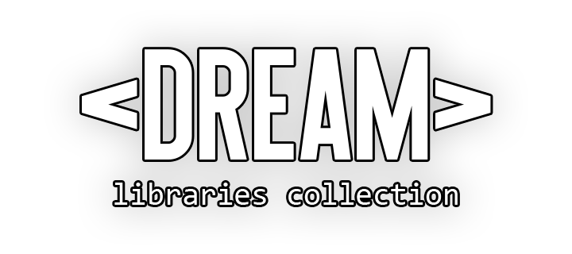

# DREAM

<p align="center">
  
</p>


DREAM (_**D**ynamic **R**eal-time **E**mbedded **A**rduino **M**odules_) is a collection of usefull modules for ESP8266/ESP32 projects on the Arduino Framework.

## Installation 

**For PlatformIO**: 

Just add following line to `platformio.ini` file of your project:

```ini
lib_deps = 
	https://github.com/DreamerDeLy/dream.git
```

Also you can select specific version, using tag:

```ini
lib_deps = 
	https://github.com/DreamerDeLy/dream.git#v0.2.0
```

**For ArduinoIDE**: 

1. Download source code as zip (green button "Code" > Download ZIP) or go to the Releases tab on this page and download one of the versions. 
2. Open the Arduino IDE and click to the "Sketch" menu and then Include Library > Add ZIP library.
3. Select downloaded ZIP file. 

## Modules

- **Containers**
  - [**Value**](/src/containers/value.h) - Container for any single value that stores the data type, units of measurement, the sensor from which the data was obtained, and a name.
  - [**Data**](src/containers/data.h) - Container for a set of `Value` objects, which has tools for their search and processing, as well as the function of averaging data in an array of `Data` objects.
  - [**Units Convert**](src/containers/units_convert.h) - Tool for converting values from one units to other. 
- **Debug**
  - [**CLI**](src/debug/cli.h) - Library for the developer's CLI, into which any command can be integrated.
  - [**Serial Logging**](src/debug/serial_logging.h) - Macro-based logging library.
- **Realtime**
  - [**Simple Timer**](src/realtime/simple_timer.h) - Simple software timer. 
  - [**Simple Stopwatch**](src/realtime/simple_stopwatch.h) - A simple object for measuring the elapsed time between the execution of some functions. 

## Build & testing

This project created with [PlatformIO](https://platformio.org/).

Use this commands to build examples: 

```powershell
pio ci --board=esp32dev examples/CLI/ --lib src/
pio ci --board=esp32dev examples/SerialLogging/ --lib src/
pio ci --board=esp32dev examples/UnitsConversion/ --lib src/
pio ci --board=esp32dev examples/Values/ --lib src/
```

Use this command to run tests (you have to have connected ESP32 to your computer):

```powershell
pio test
```

## License 

Copyright © 2019-2022 Dmytro Obukhov (DeLy Dreamer)

License: https://www.gnu.org/licenses/gpl-3.0.html